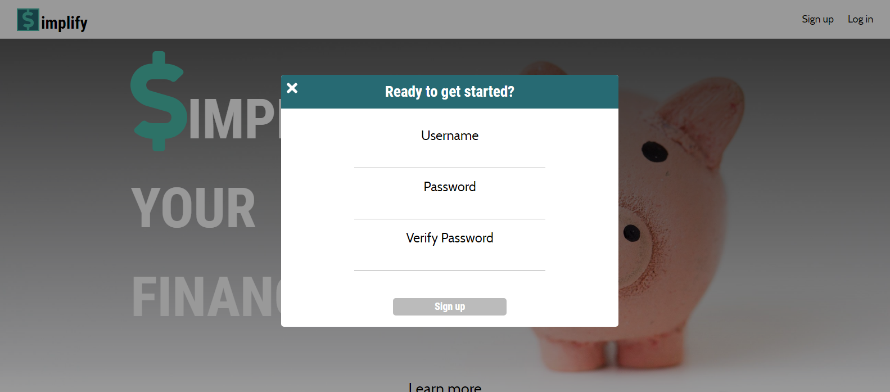
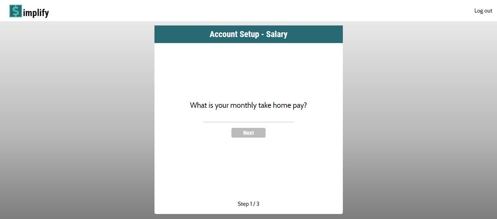
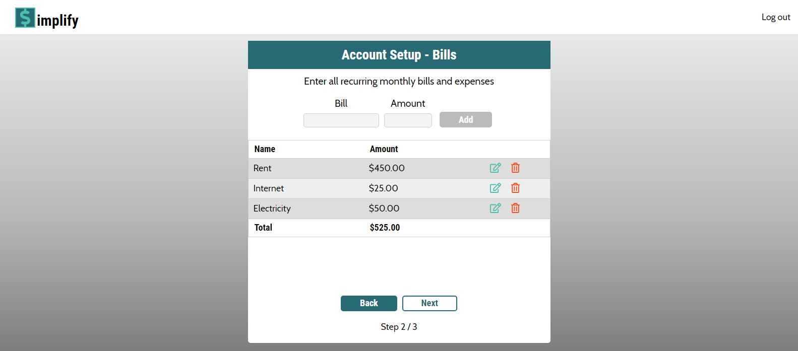
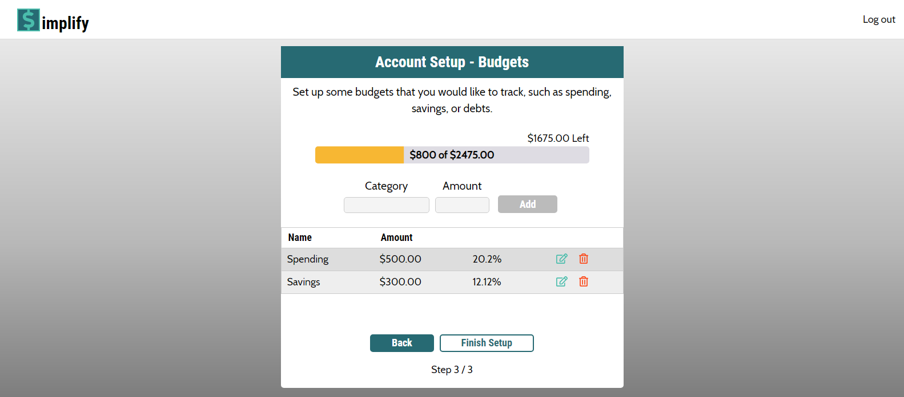
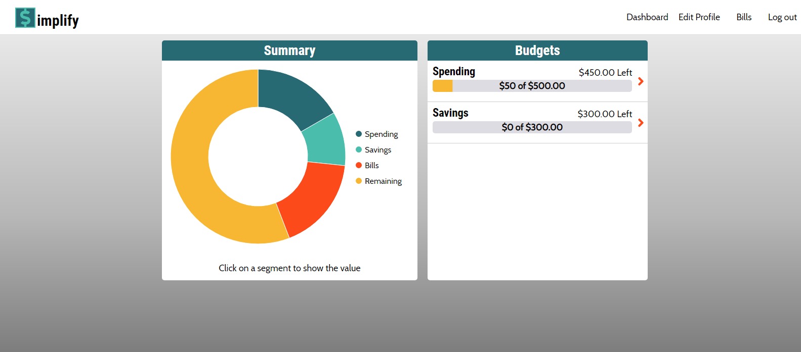
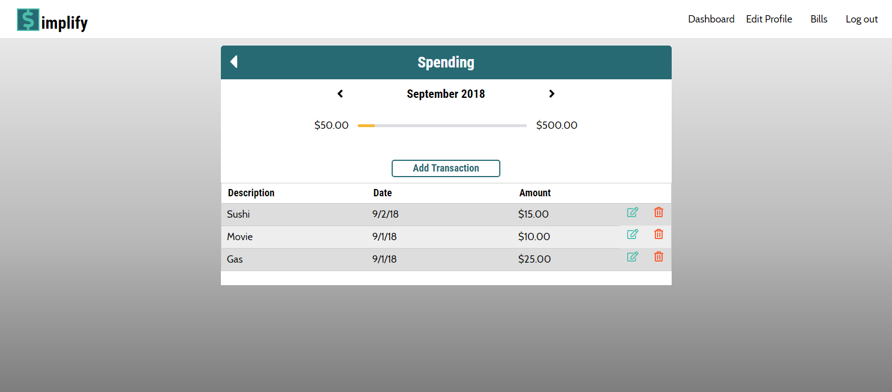
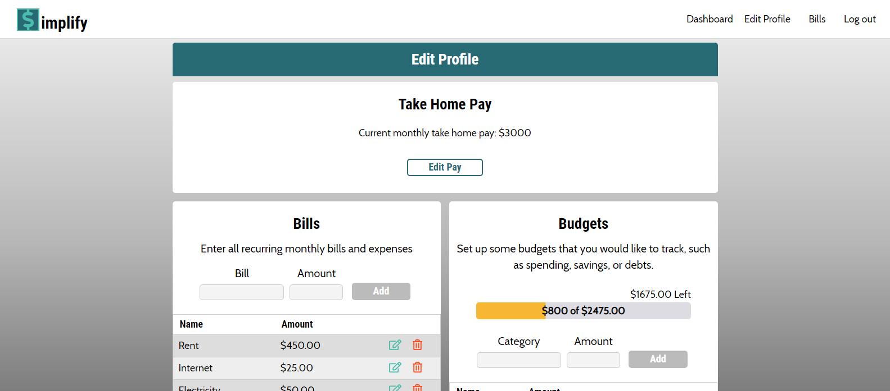

# Simplify - Budgeting Simplified
Simplify is an application that simplifies the budgeting process. Inspired by a zero based budgeting system, users are taken through a 3 step setup rpoccess. First they are asked to enter their average monthly take home pay. Then they are asked to enter each individual monthly bill or expense. Lastly, they are asked to setup budgets for areas that they would like to track their spending. Once a user makes a transaction that falls under one of these budgets, the user is able to enter that transaction and get an updated total of the exact amount of money left for them to spend in this category. What sets this app apart from others is the flexibility it offers the user. Specifically when a user creates a budget, this budget can be as specific or general as the user would like, allowing them to use the app in a way that makes sense to them.

## Built With...
### Front-End
  - HTML
  - CSS
  - React
  - Redux
  - Styled Components
  
### Back-End
  - Node.js
  - Express
  - PostgreSQL
  - Sequelize
  
### Testing
  - Enzyme
  - Mocha
  - Chai
  - Jest

## Live application
- Checkout the live app - [Simplify](https://gentle-escarpment-27186.herokuapp.com/)
- Checkout the API - [Simplify API](https://github.com/Jollendi91/simplify-budgeting-api)

## Screenshots

### Landing Page

### Signup

### Account Setup
#### Step 1

#### Step 2

#### Step 3

### Dashboard

### Budget

### Edit Profile

